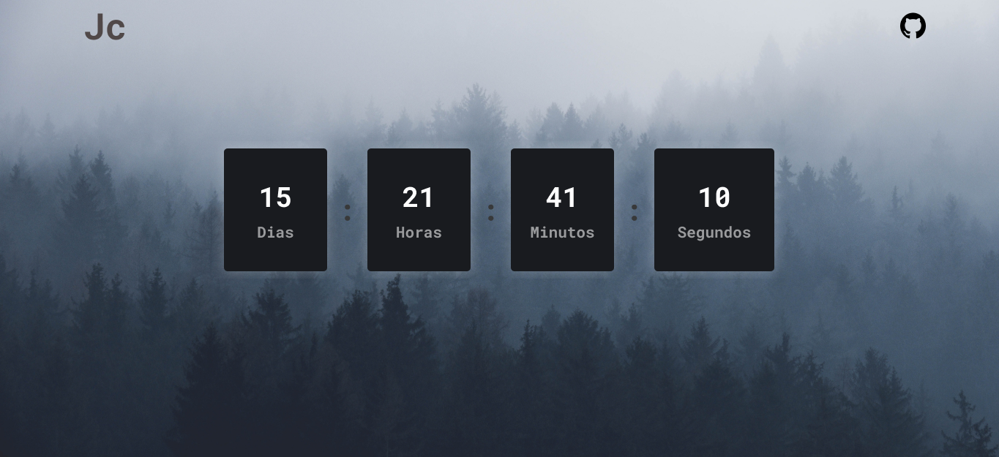

# Descrição!
Site um Relogio Digital

## ✔️ Técnicas e tecnologias utilizadas

- `Html`: estrutura e organização de texto da página principal
- `Css`: estilização da página e posicionamento dos elementos
- `Javascript`: lógica para o funcionamento do quiz para criar layout ou absorver informações e mostrar na tela.
- `DocumentQuerySelector`: selecionar tags do html para utilizar no javascript.

## ✔️ Funções Criadas.

- `constructorDate`: Função para criar elementos do layout e pegar todas as informações da variaveis globais e mostrar na tela.
- `formateDate`: Função para formatar a data corretamente
- `Função Anonima`: Função que atualizar a as informações que executar o setInterval para que ocorrar essa chamada em 1 milisegundos.

